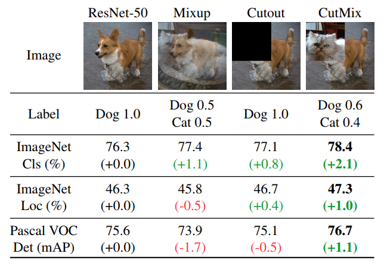

## Accepted at ICCV 2019 (oral talk) !!

## CutMix: Regularization Strategy to Train Strong Classifiers with Localizable Features

Official Pytorch implementation of CutMix regularizer | [Paper](https://arxiv.org/abs/1905.04899) | [Pretrained Models](#experiments)

**[Sangdoo Yun](mailto:sangdoo.yun@navercorp.com), Dongyoon Han, Seong Joon Oh, Sanghyuk Chun, Junsuk Choe, Youngjoon Yoo.**
 
Clova AI Research, NAVER Corp.

Our implementation is based on these repositories:
- [PyTorch ImageNet Example](https://github.com/pytorch/examples/tree/master/imagenet)
- [PyramidNet-PyTorch](https://github.com/dyhan0920/PyramidNet-PyTorch)


### Abstract
Regional dropout strategies have been proposed to enhance the performance of convolutional neural network classifiers. 
They have proved to be effective for guiding the model to attend on less discriminative parts of objects 
(e.g. leg as opposed to head of a person), thereby letting the network generalize better and have better object localization capabilities.
On the other hand, current methods for regional dropout removes informative pixels on training images by overlaying a patch of either black pixels or random noise. 
Such removal is not desirable because it leads to information loss and inefficiency during training.
We therefore propose the **CutMix** augmentation strategy: patches are cut and pasted among training images where the ground truth labels are also mixed proportionally to the area of the patches.
By making efficient use of training pixels and retaining the regularization effect of regional dropout, CutMix consistently outperforms the state-of-the-art augmentation strategies on CIFAR and ImageNet classification tasks, as well as on the ImageNet weakly-supervised localization task.
Moreover, unlike previous augmentation methods, our CutMix-trained ImageNet classifier, when used as a pretrained model, results in consistent performance gains in Pascal detection and MS-COCO image captioning benchmarks.
We also show that CutMix improves the model robustness against input corruptions and its out-of-distribution detection performances.


### Overview of the results of Mixup, Cutout, and CutMix. 



## Updates
**23 May, 2019**: Initial upload

## Getting Started
### Requirements
- Python3
- PyTorch (> 1.0)
- torchvision (> 0.2)
- NumPy

### Train Examples
- CIFAR-100: We used 2 GPUs to train CIFAR-100.
```
python train.py \
--net_type pyramidnet \
--dataset cifar100 \
--depth 200 \
--alpha 240 \
--batch_size 64 \
--lr 0.25 \
--expname PyraNet200 \
--epochs 300 \
--beta 1.0 \
--cutmix_prob 0.5 \
--no-verbose
```
- ImageNet: We used 4 GPUs to train ImageNet. 
```
python train.py \
--net_type resnet \
--dataset imagenet \
--batch_size 256 \
--lr 0.1 \
--depth 50 \
--epochs 300 \
--expname ResNet50 \
-j 40 \
--beta 1.0 \
--cutmix_prob 1.0 \
--no-verbose
```

### Test Examples using Pretrained model
- Download [CutMix-pretrained PyramidNet200 (top-1 error: 14.23)](https://www.dropbox.com/sh/o68qbvayptt2rz5/AACy3o779BxoRqw6_GQf_QFQa?dl=0) 
```
python test.py \
--net_type pyramidnet \
--dataset cifar100 \
--batch_size 64 \
--depth 200 \
--alpha 240 \
--pretrained /set/your/model/path/model_best.pth.tar
```
- Download [CutMix-pretrained ResNet50 (top-1 error: 21.40)](https://www.dropbox.com/sh/w8dvfgdc3eirivf/AABnGcTO9wao9xVGWwqsXRala?dl=0)
```
python test.py \
--net_type resnet \
--dataset imagenet \
--batch_size 64 \
--depth 50 \
--pretrained /set/your/model/path/model_best.pth.tar
```

<h2 id="experiments">Experimental Results and Pretrained Models</h2>

- PyramidNet-200 pretrained on CIFAR-100 dataset:

Method | Top-1 Error | Model file
-- | -- | --
PyramidNet-200 [[CVPR'17](https://arxiv.org/abs/1610.02915)] (baseline) | 16.45 | [model](https://www.dropbox.com/sh/6rfew3lr761jq6c/AADrdQOXNx5tWmgOSnAw9NEVa?dl=0)
PyramidNet-200 + **Cutmix** | **14.23** | [model](https://www.dropbox.com/sh/o68qbvayptt2rz5/AACy3o779BxoRqw6_GQf_QFQa?dl=0)
PyramidNet-200 + Shakedrop [[arXiv'18](https://arxiv.org/abs/1802.02375)] + **Cutmix**  | **13.81** | -
PyramidNet-200 + Mixup [[ICLR'18](https://arxiv.org/abs/1710.09412)] | 15.63 | [model](https://www.dropbox.com/sh/g55jnsv62v0n59s/AAC9LPg-LjlnBn4ttKs6vr7Ka?dl=0)
PyramidNet-200 + Manifold Mixup [[ICML'19](https://arxiv.org/abs/1806.05236)] | 16.14 | [model](https://www.dropbox.com/sh/nngw7hhk1e8msbr/AABkdCsP0ABnQJDBX7LQVj4la?dl=0)
PyramidNet-200 + Cutout [[arXiv'17](https://arxiv.org/abs/1708.04552)] | 16.53 | [model](https://www.dropbox.com/sh/ajjz4q8c8t6qva9/AAAeBGb2Q4TnJMW0JAzeVSpfa?dl=0)
PyramidNet-200 + DropBlock [[NeurIPS'18](https://arxiv.org/abs/1810.12890)] | 15.73 | [model](https://www.dropbox.com/sh/vefjo960gyrsx2i/AACYA5wOJ_yroNjIjdsN1Dz2a?dl=0)
PyramidNet-200 + Cutout + Labelsmoothing | 15.61 | [model](https://www.dropbox.com/sh/1mur0kjcfxdn7jn/AADmghqrj0dXAG0qY1v3Csb6a?dl=0)
PyramidNet-200 + DropBlock + Labelsmoothing | 15.16 | [model](https://www.dropbox.com/sh/n1dn6ggyxjcoogc/AADpSSNzvaraSCqWtHBE0qMca?dl=0)
PyramidNet-200 + Cutout + Mixup | 15.46 | [model](https://www.dropbox.com/sh/5run1sx8oy0v9oi/AACiR_wEBQVp2HMZFx6lGl3ka?dl=0)


- ResNet models pretrained on ImageNet dataset:

Method | Top-1 Error | Model file
-- | -- | --
ResNet-50 [[CVPR'16](https://arxiv.org/abs/1512.03385)] (baseline) | 23.68 | [model](https://www.dropbox.com/sh/phwbbrtadrclpnx/AAA9QUW9G_xvBdI-mDiIzP_Ha?dl=0)
ResNet-50 + **Cutmix** | **21.40** | [model](https://www.dropbox.com/sh/w8dvfgdc3eirivf/AABnGcTO9wao9xVGWwqsXRala?dl=0)
ResNet-50 + **Feature Cutmix** | **21.80** | [model](https://www.dropbox.com/sh/zj1wptsg0hwqf0k/AABRNzvjFmIS7_vOEQkqb6T4a?dl=0)
ResNet-50 + Mixup [[ICLR'18](https://arxiv.org/abs/1710.09412)] | 22.58 | [model](https://www.dropbox.com/sh/g64c8bda61n12if/AACyaTZnku_Sgibc9UvOSblNa?dl=0)
ResNet-50 + Manifold Mixup [[ICML'19](https://arxiv.org/abs/1806.05236)] | 22.50 | [model](https://www.dropbox.com/sh/bjardjje11pti0g/AABFGW0gNrNE8o8TqUf4-SYSa?dl=0)
ResNet-50 + Cutout [[arXiv'17](https://arxiv.org/abs/1708.04552)] | 22.93 | [model](https://www.dropbox.com/sh/ln8zk2z7zt2h1en/AAA7z8xTBlzz7Ofbd5L7oTnTa?dl=0)
ResNet-50 + AutoAugment [[CVPR'19](https://arxiv.org/abs/1805.09501)] | 22.40* | -
ResNet-50 + DropBlock [[NeurIPS'18](https://arxiv.org/abs/1810.12890)] | 21.87* | -
ResNet-101 + **Cutmix** | **20.17** | [model](https://www.dropbox.com/sh/1z4xnp9nwdmpzb5/AACQX4KU8XkTN0JSTfjkCktNa?dl=0)

\* denotes results reported in the original papers

## Transfer Learning Results

Backbone | ImageNet Cls (%) | ImageNet Loc (%) | CUB200 Loc (%) | Detection (SSD) (mAP) | Detection (Faster-RCNN) (mAP) | Image Captioning (BLEU-4)
-- | -- | -- | -- | -- | -- | --
ResNet50 | 23.68 | 46.3 | 49.41 | 76.7 | 75.6 | 22.9
ResNet50+Mixup | 22.58 | 45.84 | 49.3 | 76.6 | 73.9 | 23.2
ResNet50+Cutout | 22.93 | 46.69 | 52.78 | 76.8 | 75 | 24.0
ResNet50+**CutMix** | **21.60** | **46.25** | **54.81** | **77.6** | **76.7** | **24.9**


## Other Implementations (not official)
- [Pytorch-CutMix](https://github.com/hysts/pytorch_cutmix) by hysts  


## Citation
```
@article{CutMix,
  title={CutMix: Regularization Strategy to Train Strong Classifiers with Localizable Features},
  author={Yun, Sangdoo and Han, Dongyoon and Oh, Seong Joon and Chun, Sanghyuk and Choe, Junsuk and Yoo, Youngjoon},
  journal={arXiv preprint arXiv:1905.04899},
  year={2019}
}
```

## License
```
Copyright (c) 2019-present NAVER Corp.

Permission is hereby granted, free of charge, to any person obtaining a copy
of this software and associated documentation files (the "Software"), to deal
in the Software without restriction, including without limitation the rights
to use, copy, modify, merge, publish, distribute, sublicense, and/or sell
copies of the Software, and to permit persons to whom the Software is
furnished to do so, subject to the following conditions:

The above copyright notice and this permission notice shall be included in
all copies or substantial portions of the Software.

THE SOFTWARE IS PROVIDED "AS IS", WITHOUT WARRANTY OF ANY KIND, EXPRESS OR
IMPLIED, INCLUDING BUT NOT LIMITED TO THE WARRANTIES OF MERCHANTABILITY,
FITNESS FOR A PARTICULAR PURPOSE AND NONINFRINGEMENT.  IN NO EVENT SHALL THE
AUTHORS OR COPYRIGHT HOLDERS BE LIABLE FOR ANY CLAIM, DAMAGES OR OTHER
LIABILITY, WHETHER IN AN ACTION OF CONTRACT, TORT OR OTHERWISE, ARISING FROM,
OUT OF OR IN CONNECTION WITH THE SOFTWARE OR THE USE OR OTHER DEALINGS IN
THE SOFTWARE.
```
